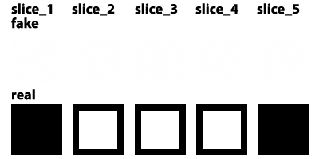

## cellular-probabilistic

[](http://github.com/badges/stability-badges)

This is a Tensorflow implementation of the [3D-Integrated-Cell](https://www.biorxiv.org/content/early/2017/12/21/238378) (cellular-probabilistic) Model.

```
@article {Johnson238378,
author = {Johnson, Gregory R. and Donovan-Maiye, Rory M. and Maleckar, Mary M.},
title = {Building a 3D Integrated Cell},
year = {2017},
doi = {10.1101/238378},
publisher = {Cold Spring Harbor Laboratory},
URL = {https://www.biorxiv.org/content/early/2017/12/21/238378},
eprint = {https://www.biorxiv.org/content/early/2017/12/21/238378.full.pdf},
journal = {bioRxiv}
}
```
#

### Model implementation details:
* Provides implementation of a distributed trainer.
* Single-host-multi-device. (each replica has this assumed configuration).
* Synchronous gradient averaging for devices.
* Asynchronous training for replicas.
* Between-graph replication.
* Exported model contains required info for serving using both configurations: standard Tensorflow ModelServer and AWS Lambda Python backend.

### Model implementation `limitations`:
* Synchronous replica update not fully implemented.
* Parameter servers use 'cpu', 'gpu' as parameter server not supported.
* Multiple 'cpu' on same worker not supported.
* Implementation is not tested/benchmarked for the actual dataset. The reference states 2-week training time on 2 NVIDIA V100 GPUs for the PyTorch implementation. 
* Implementation is only tested locally on synthetic debug dataset. Benchmarking on actual dataset depends on availibility of resources.

    fig. Image slices along the x-dim of a hollow cube:

    

#
